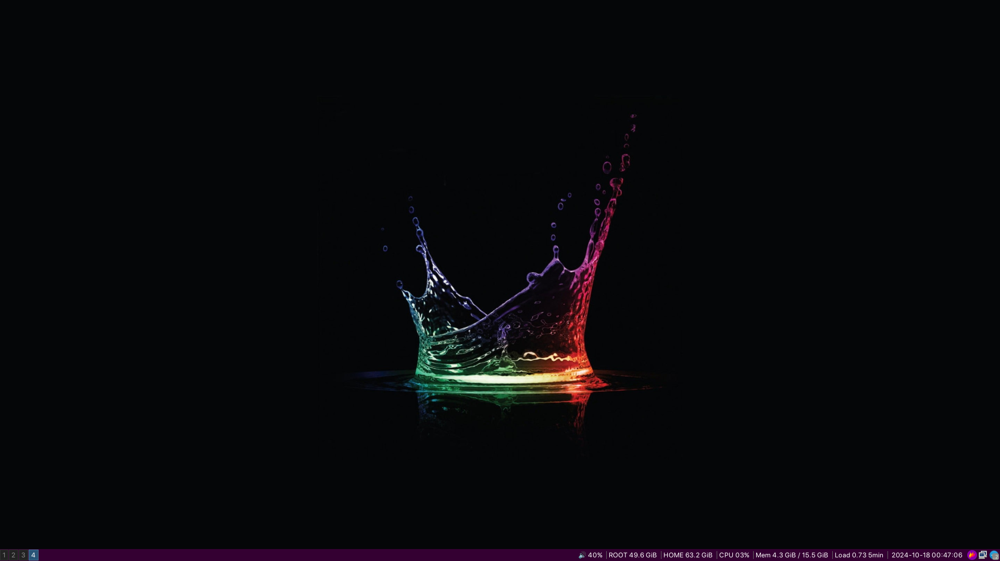
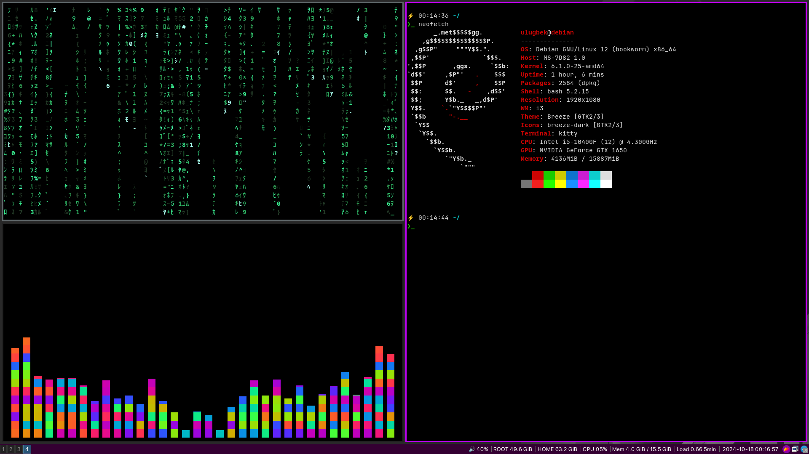

# i3wm
## Minimalistic i3wm dots

## Attention! Read the Readme fully before you switch to i3 wm. 
### Tested on Debian 12 Stable
### Screenshots




### Installation
#### Needed packages:
- i3
- kitty (terminal emulator)
- rofi (application launcher)
- feh (background image changer)
- flameshot (screensaver)
- nemo (highly customizable file manager)
- pactl (comes with pulseaudio)
- playerctl (to control audio play)
- x11-xkb-utils (to change keyboard layouts)
- xinput (to configure mouse sensitivity)

- "SF Pro Display" font - default font for i3

After installation needed packages, create needed folder:

```mkdir -p $HOME/.config/i3```


Move the rofi folder inside the repo to the ```$HOME/.config/``` folder. Move all files inside the current repo to the ```$HOME/.config/i3``` folder.

Make scripts executable to make them work properly: ```chmod +x $HOME/.config/i3/Scripts/*.sh```

### Custom configs
#### Keybindings. Full list of keybindings you can find in official web site: [i3wm](https://i3wm.org/)

##### Mod = Alt key
##### Super = Windows key

- Mod + Shift + w -> change wallpaper (wallpaper gets changed automatically in every 15 minutes)
- Super + space -> change the keyboard layouts (en/ru)
- Printsc -> run the screensaver tool
- Mod + Backspace -> run dialogue for logout, suspend, hibernate, lock, shutdown, restart
- Mod + Ctrl + Shift + l -> quick lock screen (lockscreen wallpapers will be chosen randomly)

#### Rice contains some specific settings !

Edit ```kbd_layouts.config``` for relevant layouts for you.
If you're using laptop, uncomment ```#order += "battery 0"``` line in ```i3status.config``` to enable showing battery info.
You can change rofi theme in ```rofi.config```. Additional themes are stored in the ```rofi/themes``` folder.

Run ```xrandr``` in the terminal and get your monitors' information. Edit the ```Scripts/refresh_rate.sh``` script, change monitor, refresh rate and resolution with relevant ones for you pc or just comment ```exec --no-startup-id bash $HOME/.config/i3/Scripts/refresh_rate.sh``` line in ```executor.config``` file to use default ones.

Mouse pointer speed is being configured by ```pointer_speed.sh``` script. The speed is configured between -1 (slower) and 1 (faster). Change the id(in my case it is 16) of the mouse with one of yours. You can get list of devices by running ```xinput```. If you are fine with default mouse pointer speed, then just comment the ```exec --no-startup-id bash $HOME/.config/i3/Scripts/pointer_speed.sh``` line in ```executor.conf```.